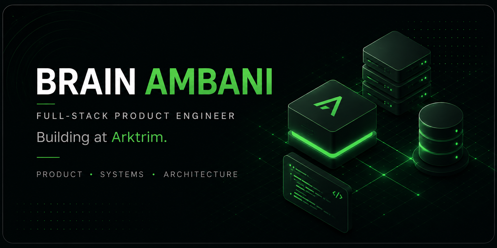

  

<table>
<tr>
<td align="center">
<a href="https://arktrim.com"><strong>↗ ARKTRIM</strong></a>
</td>
<td align="center">
<a href="https://brainambani.com"><strong>◉ PORTFOLIO</strong></a>
</td>
<td align="center">
<a href="https://x.com/brain_kraft"><strong>𝕏 X</strong></a>
</td>
<td align="center">
<a href="mailto:brainambani1@gmail.com"><strong>✉ EMAIL</strong></a>
</td>
</tr>
</table>

 

## Building

<table>
<tr>

<td width="33%" valign="top">

### Arktrim Commerce

E-commerce infrastructure for Kenyan retailers.

Next.js · NestJS · PostgreSQL

</td>

<td width="33%" valign="top">

### HQmerce

POS and business operating software for SMEs.

Next.js · TypeScript · PostgreSQL

</td>

<td width="33%" valign="top">

### Klosr

SaaS for proposal visibility and sales follow-up.

Next.js · TypeScript · PostgreSQL

</td>

</tr>
</table>

 

## Focus

**Product Engineering**  · 
**System Design**  · 
**SaaS**  · 
**E-commerce**  · 
**Business Systems**

 

## Stack

 

Building useful software, one system at a time.

 

Nairobi, Kenya 🇰🇪

